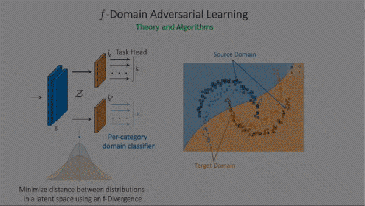

***f-Domain-Adversarial Learning: Theory and Algorithms***

**ICML 2021** 


[[Project Website]](https://nv-tlabs.github.io/fDAL/) [[Arxiv]](https://arxiv.org/abs/2106.11344) [[PMLR]](http://proceedings.mlr.press/v139/acuna21a.html)

[](https://travis-ci.org/joemccann/dillinger)


##### What is fDAL?


fDAL is a general algorithm that minimizes the discrepancy between the two domains (e.g. sim and real, or an older and a new sensor -- be it camera, LIDAR, radar, etc.) in a latent space using general f-divergences and a per-category domain classifier. fDAL does not require labels in the new domain (but can also leverage them).


----




More information can be found in our ICML 2021 paper [here](https://arxiv.org/abs/2106.11344)


##### Install

```bash 
pip install git+https://github.com/nv-tlabs/fdal
```


##### Usage

This library provides a simple subclass of `torch.nn.Module` that allows to simply add f-DAL to most architectures and training procedures. 
After installation, first, import the fDAL Learner into your code. Then, specify to the fDAL learner the feature extractor (backbone), taskhead, taskloss, and divergence.
We provide a simple example below. Notice fDAL only adds a few lines of code to the existing pipeline.

```python
from fDAL import fDALLearner

# ....
# your boilerplate code to load model, dataloader, define loss, optimizer.
# i.e..
# backbone, taskhead, num_classes = build_network()
# 
# train_source, train_target,num_classes = build_data_loaders()
# set num of classes =-1 if you use a multihead network, or the loss is regression.
# ....
# define the loss function....
# taskloss = nn.CrossEntropyLoss()

# Add fDAL to your code
model = fDALLearner(backbone, taskhead, taskloss, divergence='pearson', num_classes=num_classes)
# --end fDAL

# keep the same training loop...                          
for epoch in range(num_epochs):
    for i in range(iter_per_epoch):
        x_s, x_t, label_s = sample_from_dataloaders()
        loss, _ = model((x_s, x_t), label_s)
        optim.zero_grad()
        loss.backward()
        optim.step()
# ...
backbone, taskhead = model.get_reusable_model()

```


___

### Demos
We provide demos for the Digits and Office-31 benchmarks. These demos allow to reproduce the experiments in our paper.

___Datasets for Demos___
* MNIST->USPS  [Link](https://drive.google.com/file/d/17t8CYjkCEolbm9BAoAHohB_QM1uiL8VW/view?usp=sharing)
* Office-31 Benchmark [Link](https://drive.google.com/file/d/1AC6oGTmUfZqMI0l_nKpMYPabn2YlZfmJ/view?usp=sharing)

__Disclaimer on datasets__: The links above are provided for convenience and to encourage reproducibility. We do not own nor distribute these datasets.
You should check their licenses and adhere to their terms before using them.  You should also cite them if used.


### Source Code:
Together with the library, we provide the following demos. 
These demos provide a guidance in how to use our library and also allow reproducing results in the paper.
Source code of the demos, and the choice of hyperparameters is based on [MDD](https://github.com/thuml/MDD) and [CDAN](https://github.com/thuml/CDAN) and the [Transfer-Learn-Library](https://github.com/thuml/Transfer-Learning-Library). You should also cite their work if this is used.

|Source Code   | Dataset  | Paper   |  Repo  |
|---|---|---|---|
| demos/demo_mnist_usps.py   |  Digits  (M->U)  | 95.3   | 95.7|
| demos/demo_office31.py   |  Office-31 (A->W)  | 95.4   | 95.5|


##### Tested on
* Python 3.7
* PyTorch 1.5.1
* CUDA 10.1 toolkit

##### How to run

```bash
python demos/demo_mnist_usps.py --divergence="pearson" 
python demos/demo_office31.py --divergence="pearson" --root_src=directory_with_office_31_dataset #(e.g. /data/office31/)
```

---
```
Copyright (c) 2021, NVIDIA CORPORATION & AFFILIATES. All rights reserved. (Pending Pattent)

LICENSE: NVIDIA Source Code License (see LICENSE.md)
```

---

---
```bibtex
@InProceedings{AcunaICML21_fDAL,
  title = 	 {f-Domain-Adversarial Learning: Theory and Algorithms},
  author =       {Acuna, David and Zhang, Guojun and Law, Marc and Fidler, Sanja },
  booktitle = 	 {Proceedings of the 38th International Conference on Machine Learning},
  pages = 	 {66--75},
  year = 	 {2021},
  publisher =    {PMLR},
}
```
